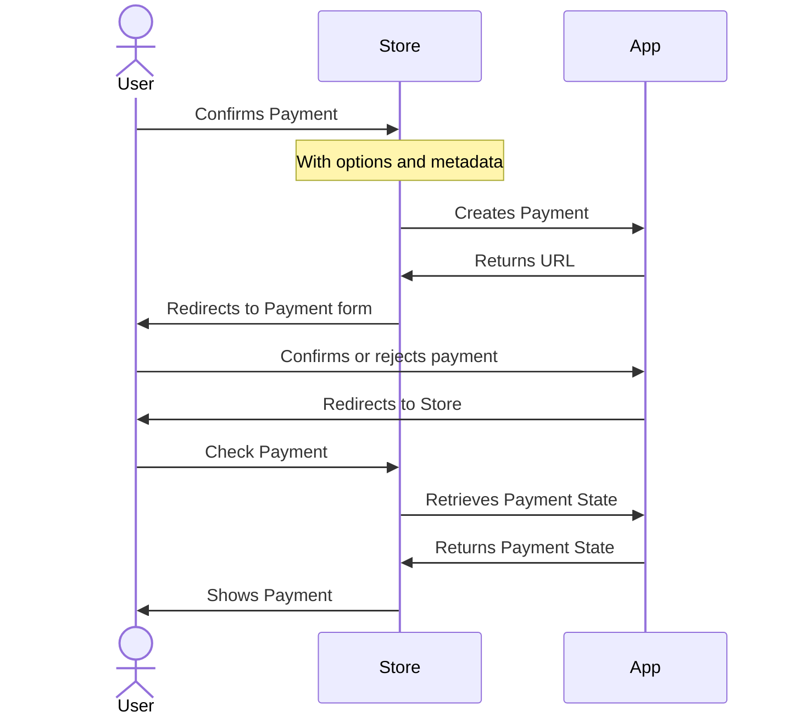

# Pay
[](https://github.com/Laragear/Permissions/actions)

# Pay
[](https://github.com/Laragear/Permissions/actions)

Payment gateway implementation for any Laravel project.

```php
use Illuminate\Http\Request;
use Laragear\Pay\Models\Payment;

public function create(Request $request)
{
    $request->validate([
        // ...
    ]);

    return $request->create(['amount' => 100, 'items' => 'Teddy Bear XL']);
}

public function form(Payment $payment)
{
    return view('laragear::payment.form')->with('payment', $payment)
}

public function confirm(Request $request, Payment $payment)
{
    $request->validate([
        // ...
    ]);

    return $payment->markAsSuccessful();
}
```

## [Download it](https://github.com/sponsors/DarkGhostHunter/sponsorships?sponsor=DarkGhostHunter&tier_id=425293)

[](https://github.com/sponsors/DarkGhostHunter/sponsorships?sponsor=DarkGhostHunter&tier_id=425293)

[Become a Sponsor and get instant access to this package](https://github.com/sponsors/DarkGhostHunter/sponsorships?sponsor=DarkGhostHunter&tier_id=425293).

## Requirements

* Laravel 10 or later

## Installation

You can install the package via Composer. Open your `composer.json` and point the location of the private repository under the `repositories` key.

```json
{
    // ...
    "repositories": [
        {
            "type": "vcs",
            "name": "laragear/pay",
            "url": "https://github.com/laragear/pay.git"
        }
    ],
}
```

Then call Composer to retrieve the package.

```shell
composer require laragear/pay
```

You will be prompted for a personal access token. If you don't have one, follow the instructions or [create one here](https://github.com/settings/tokens/new?scopes=repo). It takes just seconds.

> [!NOTE]
>
> You can find more information about in [this article](https://darkghosthunter.medium.com/php-use-your-private-repository-in-composer-without-ssh-keys-da9541439f59).

## How it works?

Laragear Pay creates a payment gateway flow to create payments, show payment views, and confirm payments if needed, all within your own application. The payment flow is the standard `User → Store → Your App → Store`:



In a nutshell, your application will receive data to create a payment, like the amount to pay and the items or Order ID. Then, your app will return a redirection URL to an application route where the user can agree on the payment itself. This package includes a sample view for that.

Once the user approves or rejects the payment, it will be redirected back to the store. The Store may receive an [inline payment status](#inline-status), or retrieve the payment from the app manually and check if it was successful or not.

## Setup

To enable payments in your app, fire the Artisan CLI to publish all the assets of Laragear Payments.

```shell
php artisan pay:install
```

You will receive one migration file, default controllers, a sample view, and a configuration file.

### 1. Migrating

There is only a single migration file in `/database/migrations`, which will create a table to store the payments. Before migrating, you can [edit it](#migrations).

```shell
php artisan migrate
```

### 2. Register routes (optional)

> [!NOTE]
>
> You can skip this step if you don't want to use the included default routes by [creating your own](https://laravel.com/docs/11.x/routing).

To fully enable the payment flow, you will need two pair of routes: one pair to create and retrieve payments from the Store, and a second pair to show and confirm the payment to the User. The first pair is not necessary if you're creating payments from your application instead of a third-party Store.

The fastest way to register the default routes is to go into your `routes/api.php` and `routes/web.php` files to register the api and web routes, respectively. The API routes are used to communicate with the Store, while the Web routes are used for the user to approve or reject the payment.

```php
// routes/api.php
Laragear\Pay\Http\Routes::registerApi();
```

```php
// routes/web.php
Laragear\Pay\Http\Routes::registerWeb();
```

> [!NOTE]
>
> If the `routes/api.php` route file doesn't exist, you can [enable it](https://laravel.com/docs/11.x/routing#api-routes) using the `install:api` Artisan command.
>
> ```shell
> php artisan install:api
> ```

You may change the base routes for both pairs and the controller to use by issuing them as arguments.

```php
Laragear\Pay\Http\Routes::registerApi(
    prefix: 'payment',
    controller: \App\Http\Controllers\MyApiPaymentController::class,
);

// [POST] https://myapp.com/payment
// [GET]  https://myapp.com/payment/{payment}
```

### Authentication

You may use the helper to include authentication middleware in both pairs of routes registered. For example, you may want to protect the payment creation in the `api` routes under Laravel Sanctum, while protecting the `web` routes under normal authentication.

```php
// routes/api.php
Laragear\Pay\Http\Routes::registerApi()->middleware('auth:sanctum');
```

```php
// routes/web.php
Laragear\Pay\Http\Routes::registerWeb()->middleware('auth:web');
```

For the case of the `web` routes, Laravel will automatically redirect the user to the intended route, which is the payment form, once he authenticates. You may even engineer a new authentication guard that only works for a given Payment ID to require authentication for every transaction.

## Creating payments

Everything starts with the Store sending the information to create a Payment.

A Payment requires three key ingredients: the **amount** to pay, the route name the user will be **redirected** to your app to confirm the payment, and the Store URL the user will **return** to finish the transaction.

> [!TIP]
>
> If you're using the default routes to show the payment, don't worry, the redirection URL is automatically generated for the `payment.show` route. The return URL is still mandatory.

To create a Payment, you may use the `Pay` facade anywhere in your application, with the `fromRequest()` method that will automatically fill the payment with the amount, currency, the URL to return, and any metadata given.

This method return an `Intent` instance, which contains the information on how to proceed with the payment.

```php
namespace App\Http\Controllers;

use Illuminate\Http\Request;
use Laragear\Pay\Facades\Pay;

class PaymentController
{
    /**
     * Create a new Payment.
     *
     * @param  \Illuminate\Http\Request  $request
     * @return \Laragear\Pay\Intent
     */
    public function create(Request $request)
    {
        $request->validate([
            'amount' => 'required|int|min:1',
            'currency' => 'required|string|in:usd,eur,clp'
            'return' => 'required|url',
        ]);
        
        return Pay::fromRequest();
    }
}
```

Alternatively, you can fill each payment attribute manually through the facade.

```php
use Laragear\Pay\Facades\Pay;

return Pay::amount($request->amount, 'usd')
    ->at('myapp/payments/pay')
    ->andReturnTo($request->return));
```

> [!TIP]
>
> Payment amounts are always saved into signed integers. If you need control on float or decimals, you may [use the Money package](#retrieving-money-amounts).

While the Payment information is stored in the database, the facade returns a JSON response. This response contains the Payment ID, the URL where the user browser should be redirected to complete the payment, and the expiration time for the payment as a timestamp.

```json
{
    "id": "018e49d2-afa7-7245-8179-a510fb738608",
    "redirect": "https://app.com/payment/018e49d2-afa7-7245-8179-a510fb738608",
    "expires": 1234567890123
}
```

The expiration time represents when the Payment can no longer be made. The URL should be used by the Store to redirect the user to your application. The `id` is there just for convenience.

### Changing the redirection URL

Sometimes you may want to change where the user should be redirected to your application. For example, a custom path with some parameters, or the path for a given controller action.

You can change the redirection URL using the `at()`, `atRoute()` or `atAction()` parameters. The Payment ID will be added to the parameter list as the `payment` parameter automatically, either as a query or as a route parameter if it exists.

```php
use App\Http\Controllers\MyPaymentController;
use Laragear\Pay\Facades\Pay;

return Pay::amount($request->amount)
    ->atAction([MyPaymentController::class, 'pay'])
    ->andReturnTo($request->return_url);

// "url": https://myapp.com/payments/pay/018e49d2-afa7-7245-8179-a510fb738608
```

> [!WARNING]
>
> When adding additional parameters to the redirection URL, the `payment` query parameter with the Payment ID will always take precedence.

If you want to make an iOS/Android App URL, or a special string, use `atRaw()`. The path and parameters won't be verified by your application, so you're free to put whatever you need. This can be useful if you expect payments to be done in-app rather than directly on the web.

```php
use Laragear\Pay\Facades\Pay;

return Pay::amount($request->amount)
    ->atRaw('my-app://payment/show')
    ->andReturnTo($request->return_url);

// my-app://payment/show?payment=018e49d2...
```

## Showing Payments

After the browser redirects the user from the Store to your App, a controller will be hit with the Payment ID. This controller should show a form with the payment information, asking the user to confirm the transaction.

You should type-hint the `PendingPayment` model instead of the base `Payment` model. This way the user is only shown the payment that has not yet _settled_.

```php
use Illuminate\Support\Facades\Route;
use Laragear\Pay\Models\PendingPayment;

Route::get('/payment/{payment}', function (PendingPayment $payment) {
    if ($payment->isSettled()) {
        return $payment->toStore();
    }
        
    return view('laragear::pay.show', ['payment' => $payment]);
});
```

The controller action should check if the payment has been already completed through the `isCompleted()` method. This way, if it is, the user is returned to the store instead of paying again.

After that, you should show an HTML form to accept or reject the payment. Laragear includes a Blade view called `laragear::pay.show` that accepts the Payment instance.

> [!NOTE]
>
> You're encouraged to create your own form by overriding the `view/vendor/laragear/pay/show.blade.php` Blade view file. For example, you may add a company logo, show the Payment metadata like the Order ID, add SMS validation, or even let the user select a custom payment option like a gift card or store points.

## Completing Payments

The payment completion is done through a receiving a form submission.

You should type-hint the `PendingPayment` model instead of the base `Payment` model. This way the user is only shown pending payments (not expired and not yet completed).

```php
use Illuminate\Http\Request;
use Illuminate\Support\Facades\Route;
use Laragear\Pay\Models\PendingPayment;

Route::post('/payment/{payment}', function (Request $request, PendingPayment $payment) {
    $request->validate(['approved' => 'required|boolean']);
    
    $payment->marAsSettled($request->boolean('is_approved'), [
        'user' => 'The user has rejected the payment'
    ]);

    return $payment->toStore();
});
```

The controller receives the form submission, validates if a URL parameter called `approved` is a boolean, and then proceeds to mark the payment as "successful" or "failed" depending on the condition. Finally, returns the user back to the Store.

When the user ends the transaction, he will be automatically returned to the store by the URL issued when creating the payment. The URL will include the Payment ID as a query parameter.

    https://www.store.com/checkout?payment=018e49d2-afa7-7245-8179-a510fb738608

> [!NOTE]
>
> You're encouraged to create your own form by overriding the `view/vendor/laragear/pay/show.blade.php` Blade view file. For example, you may add a company logo, show the Payment metadata like the Order ID, add SMS validation, or even let the user select a custom payment option like a gift card or store points.

### Marking as Failed or Successful

The convenience `markAsSettled()` method receives a condition and errors to include if the condition is _falsy_. This may be good for most apps, but you may also have finer control with the `markAsSuccessful()` and `markAsFailed()` methods.

If the payment is ok, the `markAsSuccessful()` method will mark the payment as successful.

```php
$payment->markAsSuccessful();
```

On the other hand, the `markAsFailed()` will mark the payment as failed, and may be used along with an array of errors that caused the rejection. You can use this data later in your views or app to show the reasons why it was rejected.

```php
$payment->markAsFailed([
    'balance' => 'The credit card balance is below the amount to charge.',
]);
```

You may also use a simple string, or a list of strings. These will be set as the `payment` key.

```php
$payment->markFailed("The user $user->id has no balance.");

echo $payments->errors;

// [
//   "payment" => [
//      "The user 1 has no balance."
//   ]
// ]
```

Errors are formatted in arrays to play nice with the Laravel's Validation Exception.

> [!IMPORTANT]
>
> Both `markSuccessful()` and `markFailed()` methods are _exclusive_. A Payment cannot be successful and failed at the same time!

### Payment checks

If you want to check if a Payment is valid before marking it as successful, you can [use a pipeline](https://laravel.com/docs/11.x/helpers#pipeline). The `Payment` model includes a helper that creates a pipeline for checking called `pipe()`.

Pass to the `pipe()` method either an array of callbacks, class names or object instances, and these will be executed in the order given. Ideally, in your last pipe check, you should [mark the payment has successful](#marking-as-failed-or-successful).

```php
use App\Payment\Pipes\HasGiftCard;
use App\Payment\Pipes\HasGiftCardValidForPurchase;
use App\Payment\Pipes\MarkPaymentAsSuccessful;
use Illuminate\Support\Facades\Route;
use Laragear\Pay\Models\PendingPayment;

Route::post('/payment/{payment}', function (Request $request, PendingPayment $payment) {
    $request->validate(['approved' => 'required|boolean']);
    
    $payment->pipe([        
        IsApproved::class
        HasGiftCard::class
        HasGiftCardValidForPurchase::class,
        MarkPaymentAsSuccessful::class,
    ]);
    
    return $payment->toStore();
});
```

Each pipe will receive an instance of the `PaymentCheck` class, which will include the current request and payment. You may also use it to dynamically share data between pipes.

```php
namespace App\Payment\Pipes;

use App\Models\GiftCard;
use Closure;
use Laragear\Pay\PaymentCheck;

class HasGiftCard 
{
    public function handle(PaymentCheck $check, Closure $next)
    {   
        $check->request->validate([
            'gift_card_id' => 'sometimes|nullable|string'
        ]);
    
        // Add this property so the next pipe can check it out.
        $check->girfCard = GiftCard::find($check->request->gift_card_id));
        
        return $next($check);
    }
}
```

If you need to _stop_ the payment procedure because the data is not valid, but bring back the user to the form to try again, you can use the `retry()` method of the `PaymentCheck`, which creates a Validation exception you can show on the application frontend.

Otherwise, for a hard-stopping error, use the `abort()` method to stop and mark the payment as failed, along any error you may see fit.

```php
namespace App\Payment\Pipes;

use App\Models\GiftCard;
use Closure;
use Illuminate\Validation\ValidationException;
use Laragear\Pay\PaymentCheck;

class HasGiftCardValidForPurchase 
{
    public function handle(PaymentCheck $check, Closure $next)
    {
        // If the card is stolen, fail.
        if ($check->giftCard->isStolen()) {
            $check->abort(['gift_card' => 'This gift card was stolen. This incident will be reported.']);
        }
        
        if ($check->giftCard->isInvalid()) {
            // Stop and let the user try again.    
            $check->retry(['gift_card' => 'This gift card has expired or was already used.']);
        }
        
        return $next($payment);
    }
}
```

### Inline status

Normally, you would wait for the store to [make a final round to your app](#returning-the-payment) to check the payment completion. You can avoid this by instead returning the user to the store with an "inline" status. This creates a signed URL to return to the Store like this:

```http request
GET https://www.store.com/checkout/return?is_successful=1&signature=OGIgMjYgNzQgY...&payment=018e49d2-afa7-7245-8179-a510fb738608
```

The `withStatus()` method uses a _secret string_ shared between the Store and your App. The shared secret will allow the Store to check its validity and that the URL has not been tampered with. You may also include additional parameters with this method.

```php
use Laragear\Pay\Models\PendingPayment;

public function pay(PendingPayment $payment, Request $request)
{
    // ...
    
    return $payment->toStore()->withStatus('my-shared-secret', [
        'card' => 'debit'
    ]);
}
```

Note that the URL will always contain the `is_successful` key, being `1` if it is, and `0` when it fails, plus the Payment ID that identifies the payment, and the signature the store should check against the query parameters.

> [!TIP]
>
> If you're handling multiple Stores, you should set the [Store relationship](#store-relationship) when creating the Payment, so you can later retrieve the corresponding Store secret key.
>
> ```php
> return $payment->toStore()->withStatus($payment->store->shared_secret);
> ```

#### Checking the signature

Checking the signature is done with creating a signature with SHA256, the Payment ID, and the query parameters in alphabetic order.

Implementation will vary between programming languages. For example, on PHP, you may use this code.

```php
// Clone the query parameters.
$query = $_GET;

// Remove the signature from the query to be checked at.
unset($query['signature']);

// Sort the query keys alphabetically.
ksort($query);

// Create a signature using the query string and the shared secret.
$signature = hash_hmac('sha256', http_build_query($query), 'my-shared-secret');

// Check both signatures are equal.
if (! hash_equals($signature, $_GET['signature'])) {
    throw new Exception('The Payment URL has been tampered with.') 
}
```

If your Store is running under Node.js, you may use the embedded `crypto` library to check both hashes:

```javascript
import crypto from 'crypto'

async function check(request) {
    const urlObj = new URL(request.url)
    const params = new URLSearchParams(urlObj.search);

    const signature = params.get('signature');
    
    // Remove the signature from the query to be checked at.
    params.delete('signature');
    
    // Create a signature using the sorted query string and the shared secret.
    const hash = crypto.createHmac('sha256', 'my-shared-secret')
        .update(new URLSearchParams([...params.entries()].sort()).toString())
        .digest('hex');
    
    // If the signature is equal to the hash, the parameters are correct.
    return signature === await hash
}
```

## Returning the payment

Once the user is redirected back to the Store, the Store will retrieve the payment information from your application using the same Payment ID. You can type-hint the `Payment` model in your controller to show the payment.

```php
namespace App\Http\Controllers;

use Illuminate\Http\Request;
use Laragear\Pay\Facades\Pay;
use Laragear\Pay\Models\Payment;

class PaymentController
{
    /**
     * Return the payment information and confirm the payment has been retrieved.
     */
    public function retrieve(Payment $payment)
    {
        $payment->markAsConfirmed();

        return $payment;
    }
}
```

This method will allow the store to retrieve any payment knowing its ID. Alternatively, you may only show Payments that were created before 24 hours with the `CompletedPayment` model.

```php
namespace App\Http\Controllers;

use Illuminate\Http\Request;
use Laragear\Pay\Facades\Pay;
use Laragear\Pay\Models\CompletedPayment;

class PaymentController
{
    /**
     * Return the payment information and confirm the payment has been retrieved.
     */
    public function retrieve(CompletedPayment $payment)
    {
        // $payment->markConfirmed();

        return $payment;
    }
}
```

> [!TIP]
>
> The Payment model only exposes its metadata and status timestamps. You may append additional attributes by editing the [migration and model](#migrations).

If you're handling multiple stores through a [Payment relationship](#store-relationship), you may want to [use scope binding](https://laravel.com/docs/11.x/routing#implicit-model-binding-scoping) on your controller.

```php
use Illuminate\Support\Facades\Route;
use App\Models\Store;
use Laragear\Pay\Models\Payment;

Route::get('/stores/{store}/payments/{payments}', function (Store $store, Payment $payment) {
    // ...
})->scopeBindings();
```

### Confirming Payments

Before returning the Payment, you may mark the payment as "confirmed", meaning, to flag the Payment as retrieved by the Store. This is entirely optional, but useful when payments fail because of network errors, and you need to find why a payment wasn't fully processed by the Store.

```php
namespace App\Http\Controllers;

use Laragear\Pay\Facades\Pay;
use Laragear\Pay\Models\CompletedPayment;

class PaymentController
{
    /**
     * Return the payment information and confirm the payment has been retrieved.
     */
    public function retrieve(CompletedPayment $payment)
    {
        $payment->markAsConfirmed();

        return $payment;
    }
}
```

You should use `markAsConfirmed()` method to mark the whole transaction as closed, whenever possible. Most Stores will use the information of the payment returned to complete the transaction on their end. If there is an error before the Store retrieves the payment, the Store may believe the payment was not made, even if the payment was successful in your app.

Alternatively, you may want to use Laravel HTTP Client to push a request to the store when the payment is accepted or rejected as a way to ensure the store has the payment information regardless.

```php
use Illuminate\Http\Request;
use Illuminate\Support\Facades\Http;
use Laragear\Pay\Models\CompletedPayment;

/**
 * Handle the payment acceptance from the user, and redirect the user back to the store.
 */
public function pay(OpenPayment $payment, Request $request)
{
    // ...
    
    // After the response is sent, make a request to the store with the payment data.
    dispatch(function() use ($payment) {
        Http::withHeader('app-secret', 'my-store-secret')
            ->post('https://www.store.com/payments', $payment->toArray());
            
        $payment->markConfirmed();
    })->afterResponse();

    return $payment->toStore();
}
```

## Store relationship

If you're handling multiple Stores, you should create a [dynamic relationship](https://laravel.com/docs/11.x/eloquent-relationships#dynamic-relationships) on the `Laragear\Pay\Models\Payment` model so these can be _related_ to specific Stores. You should do this in the `register()` method of your `AppServiceProvider`.

```php
namespace App\Providers;

use Illuminate\Support\ServiceProvider
use Laragear\Pay\Models\Payment;
use App\Models\Store;

class AppServiceProvider extends ServiceProvider
{
    public function register()
    {
        Payment::resolveRelationUsing('store', function (Payment $model) {
            return $model->belongsTo(Store::class, 'store_id');
        });
    }
}
```

After that, you may need to [edit the migration](#migrations) with the column to associate the Payment to the Store.

```php
use Illuminate\Database\Schema\Blueprint;
use Laragear\Pay\Models\Payment;

return Payment::migration(function (Blueprint $table) {
    // Here you can create additional tables.
    $table->foreignIdFor(Store::class);
});
```

Finally, when creating your Payment, you may associate or attach the Store through using [the `onCreating()` or `onCreated()` callbacks](#events).

```php
use Illuminate\Support\Facades\Route;
use Illuminate\Http\Request;
use App\Models\Store;
use Laragear\Pay\Facades\Pay;

Route::post('payment', function (Request $request) {
    $request->validate([
        // ...
    ]);
    
    // Find the store by its API key in the header.
    $store = Store::where('api_key', $request->header('Store-Api-Key'))->firtOrFail();
    
    return Pay::amount($request->amount)
        ->withMetadata($request->only('order_id', 'currency'))
        ->onCreating(fn ($payment) => $payment->associate($store))
        ->andReturnTo($request->return_url);
});
```

For example, for a Belongs To relation, you mat use the `onCreating()` to fill the column with the apropiate Store ID, or the `onCreated()` to attach the Payment to another Model after is created.

## Money amounts

If you need to handle money fractions for some currencies, like USD, you can install the [Money package](https://github.com/moneyphp/money).

When [creating a payment](#creating-payments), you can set the amount and the currency or a `Money` instance.

```php
use Laragear\Pay\Facades\Pay;
use Money\Money;

$payment = Pay::amount(Money::EUR(500));
```

You can interact with `Money` instances using the `$payment->money` property of the `Payment` model.

```php
use Laragear\Pay\Models\Payment;
use Money\Money;

$payment = Payment::find('018e49d2...');

echo $payment->money; // \Money\Money("500", "USD")

$payment->money = Money::EUR(600); // \Money\Money("600", "EUR")
```

> [!WARNING]
>
> When using the Money package, large integers will be cropped into `PHP_INT_MAX`. If you need to work with large sums of money, you should set the amount as metadata instead.

## Events

You can execute logic before and after creating a Payment with the `onCreating()` and `onCreated()` methods. Just issue a callback that receives the `Payment` instance.

```php
use Laragear\Pay\Facades\Pay;
use Laragear\Pay\Models\Payment;

Pay::amount(100)
    ->at('/payment/show')
    ->onCreating(function (Payment $payment) {
        // Run before storing the payment...
    })
    ->onCreating(function (Payment $payment) {
        // Run after storing the payment...
    })
    ->andReturnTo('https://my-store.com/checkout');
```

This may work fine inside a controller action. Outside a controller, you can hook up a [listener or subscriber](https://laravel.com/docs/11.x/events) to the included Events with the `Payment` instance.

| Event                             | Description                                      |
|-----------------------------------|--------------------------------------------------|
| Laragear\Events\PaymentCreating   | Payment is going to be stored in the database    |
| Laragear\Events\PaymentCreated    | Payment has been stored in the database          |
| Laragear\Events\PaymentShown*     | Payment has been shown to the user               |
| Laragear\Events\PaymentSucceeded  | Payment has been marked has successful           |
| Laragear\Events\PaymentFailed     | Payment has been marked has failed               |
| Laragear\Events\PaymentSettled    | Payment has been marked has successful or failed |
| Laragear\Events\PaymentConfirmed* | Payment has been retrieved by the store          |

The `PaymentShown` and `PaymentConfirmed` may be dispatched manually in your application. These can be great to keep track of payment states.

## [Migrations](MIGRATIONS.md)

## Configuration

```php
return [
    'intent' => [
        'store' => null,
        'prefix' => 'payment_intent',
        'minutes' => 5,
    ],
    'expiration' => 60 * 24,
];
```

### Intent

```php
return [
    'intent' => [
        'store' => null,
        'prefix' => 'payment_intent',
        'minutes' => 5,
        'remove_on_completed' => true
    ],
];
```

Payments do not store into themselves the URL to pay, or the URL to return to the store. Instead, a Cache Store is used to save this ephemeral data.

By default, it uses the default Cache Store set in your application. It also includes a prefix to differentiate cache keys, and the amount of minutes the intent should be valid.

Once the Payment is completed (successful or failed), the Intent is deleted. This makes the `PendingPayment` model fail if the intent does not exist. If you want to keep the Intent until it expires, or you want to remove it yourself anytime, you can set the `remove_on_completed` to `false`.

```php
return [
    'intent' => [
        'store' => null,
        'prefix' => 'payment_intent',
        'minutes' => 5,
        'remove_on_completed' => false
    ],
];
```

### Expiration

```php
return [
    'expiration' => 60 * 24,
];
```

This sets how much time the Store can retrieve a `CompletedPayment` after its creation, in minutes. After the time has passed, the Payment won't be found. This way you can prevent abuse and force the Store to keep payment data on their end.

If this is not a problem for you Store, or you trust them enough, you can set it as `false`, `0` or `null` to allow the store to retrieve all payments by their ID, regardless of when these were created.

## Laravel Octane compatibility

- There are no singletons using a stale app instance.
- There are no singletons using a stale config instance.
- There are no singletons using a stale request instance.
- There are no static properties written during a request.

There should be no problems using this package with Laravel Octane.

## Security

If you discover any security related issues, please email darkghosthunter@gmail.com instead of using the issue tracker.

### Shared Secret

For simplicity’s sake, you can always verify a header on the request at runtime, without needing to use authentication, with a shared secret between the store and your application. The [`hash_equals()`](https://www.php.net/manual/function.hash-equals.php) function is great to avoid timing attacks.

```php
use Laragear\Pay\Facades\Pay;

public function pay(Request $request)
{
    $request->validate([
        // ...
    ]);
    
    $mySecret = 'my-secret'
    $headerSecret = $request->getHeader('store-secret');
    
    abort_unless(hash_equals($mySecret, $headerSecret), 401);

    return Pay::fromRequest();
}
```

If you need more advanced protection, you can rely on [Laravel Sanctum](https://laravel.com/docs/11.x/sanctum) to authenticate a Store using the `Authorization: Bearer` token.

```php
use App\Http\Controllers\MyPaymentController;
use Illuminate\Support\Facades\Route;

Route::get('api/payment')
    ->controller(MyPaymentController::class)
    ->middleware('auth:sanctum')
    ->group(function () {
        Route::post('/', 'create');
        Route::get('/', 'retrieve');    
    });
```

Since the `Authorization: Bearer` identifies and logs in a user for that request only, you may use that opportunity to associate a Store to the Payment using the `fromStore()` method.

```php
use Laragear\Pay\Facades\Pay;

public function pay(Request $request)
{
    $request->validate([
        // ...
    ]);
    
    return Pay::amount($request->amount)
        ->andReturnTo($request->return_url)
        ->onCreating(fn ($payment) => $payment->store_id = $request->user()->store->id);
}
```

# License

This specific package version is licensed under the terms of the [MIT License](LICENSE.md), at time of publishing.

[Laravel](https://laravel.com) is a Trademark of [Taylor Otwell](https://github.com/TaylorOtwell/). Copyright © 2011-2023 Laravel LLC.
.

```php
use Illuminate\Http\Request;
use Laragear\Pay\Models\Payment;

public function create(Request $request)
{
    $request->validate([
        // ...
    ]);

    return $request->create(['amount' => 100, 'items' => 'Teddy Bear XL']);
}

public function form(Payment $payment)
{
    return view('laragear::payment.form')->with('payment', $payment)
}

public function confirm(Request $request, Payment $payment)
{
    $request->validate([
        // ...
    ]);

    return $payment->markAsSuccessful();
}
```

## Thanks to you!

[](https://github.com/sponsors/DarkGhostHunter)

You're reading this because you're supporting me and this package. Your support allows me to keep this package free, up-to-date and maintainable. Thanks! I mean it!

## Requirements

* Laravel 10 or later

## Installation

You can install the package via Composer. Open your `composer.json` and point the location of the private repository under the `repositories` key.

```json
{
    // ...
    "repositories": [
        {
            "type": "vcs",
            "name": "laragear/pay",
            "url": "https://github.com/laragear/pay.git"
        }
    ],
}
```

Then call Composer to retrieve the package.

```shell
composer require laragear/pay
```

You will be prompted for a personal access token. If you don't have one, follow the instructions or [create one here](https://github.com/settings/tokens/new?scopes=repo). It takes just seconds.

> [!NOTE]
> 
> You can find more information about in [this article](https://darkghosthunter.medium.com/php-use-your-private-repository-in-composer-without-ssh-keys-da9541439f59).

## How it works?

Laragear Pay creates a payment gateway flow to create payments, show payment views, and confirm payments if needed, all within your own application. The payment flow is the standard `User → Store → Your App → Store`:


In a nutshell, your application will receive data to create a payment, like the amount to pay and the items or Order ID. Then, your app will return a redirection URL to an application route where the user can agree on the payment itself. This package includes a sample view for that.

Once the user approves or rejects the payment, it will be redirected back to the store. The Store may receive an [inline payment status](#inline-status), or retrieve the payment from the app manually and check if it was successful or not.

## Setup

To enable payments in your app, fire the Artisan CLI to publish all the assets of Laragear Payments. 

```shell
php artisan pay:install
```

You will receive one migration file, default controllers, a sample view, and a configuration file.

### 1. Migrating

There is only a single migration file in `/database/migrations`, which will create a table to store the payments. Before migrating, you can [edit it](#migrations). 

```shell
php artisan migrate
```

### 2. Register routes (optional)

> [!NOTE]
>
> You can skip this step if you don't want to use the included default routes by [creating your own](https://laravel.com/docs/11.x/routing).

To fully enable the payment flow, you will need two pair of routes: one pair to create and retrieve payments from the Store, and a second pair to show and confirm the payment to the User. The first pair is not necessary if you're creating payments from your application instead of a third-party Store.

The fastest way to register the default routes is to go into your `routes/api.php` and `routes/web.php` files to register the api and web routes, respectively. The API routes are used to communicate with the Store, while the Web routes are used for the user to approve or reject the payment.

```php
// routes/api.php
Laragear\Pay\Http\Routes::registerApi();
```

```php
// routes/web.php
Laragear\Pay\Http\Routes::registerWeb();
```

> [!NOTE]
> 
> If the `routes/api.php` route file doesn't exist, you can [enable it](https://laravel.com/docs/11.x/routing#api-routes) using the `install:api` Artisan command.
> 
> ```shell
> php artisan install:api
> ```

You may change the base routes for both pairs and the controller to use by issuing them as arguments.

```php
Laragear\Pay\Http\Routes::registerApi(
    prefix: 'payment',
    controller: \App\Http\Controllers\MyApiPaymentController::class,
);

// [POST] https://myapp.com/payment
// [GET]  https://myapp.com/payment/{payment}
```

### Authentication

You may use the helper to include authentication middleware in both pairs of routes registered. For example, you may want to protect the payment creation in the `api` routes under Laravel Sanctum, while protecting the `web` routes under normal authentication.

```php
// routes/api.php
Laragear\Pay\Http\Routes::registerApi()->middleware('auth:sanctum');
```

```php
// routes/web.php
Laragear\Pay\Http\Routes::registerWeb()->middleware('auth:web');
```

For the case of the `web` routes, Laravel will automatically redirect the user to the intended route, which is the payment form, once he authenticates. You may even engineer a new authentication guard that only works for a given Payment ID to require authentication for every transaction.

## Creating payments

Everything starts with the Store sending the information to create a Payment.

A Payment requires three key ingredients: the **amount** to pay, the route name the user will be **redirected** to your app to confirm the payment, and the Store URL the user will **return** to finish the transaction.

> [!TIP]
> 
> If you're using the default routes to show the payment, don't worry, the redirection URL is automatically generated for the `payment.show` route. The return URL is still mandatory.

To create a Payment, you may use the `Pay` facade anywhere in your application, with the `fromRequest()` method that will automatically fill the payment with the amount, currency, the URL to return, and any metadata given.

This method return an `Intent` instance, which contains the information on how to proceed with the payment.

```php
namespace App\Http\Controllers;

use Illuminate\Http\Request;
use Laragear\Pay\Facades\Pay;

class PaymentController
{
    /**
     * Create a new Payment.
     *
     * @param  \Illuminate\Http\Request  $request
     * @return \Laragear\Pay\Intent
     */
    public function create(Request $request)
    {
        $request->validate([
            'amount' => 'required|int|min:1',
            'currency' => 'required|string|in:usd,eur,clp'
            'return' => 'required|url',
        ]);
        
        return Pay::fromRequest();
    }
}
```

Alternatively, you can fill each payment attribute manually through the facade.

```php
use Laragear\Pay\Facades\Pay;

return Pay::amount($request->amount, 'usd')
    ->at('myapp/payments/pay')
    ->andReturnTo($request->return));
```

> [!TIP]
>
> Payment amounts are always saved into signed integers. If you need control on float or decimals, you may [use the Money package](#retrieving-money-amounts).

While the Payment information is stored in the database, the facade returns a JSON response. This response contains the Payment ID, the URL where the user browser should be redirected to complete the payment, and the expiration time for the payment as a timestamp.

```json
{
    "id": "018e49d2-afa7-7245-8179-a510fb738608",
    "redirect": "https://app.com/payment/018e49d2-afa7-7245-8179-a510fb738608",
    "expires": 1234567890123
}
```

The expiration time represents when the Payment can no longer be made. The URL should be used by the Store to redirect the user to your application. The `id` is there just for convenience.

### Changing the redirection URL

Sometimes you may want to change where the user should be redirected to your application. For example, a custom path with some parameters, or the path for a given controller action. 

You can change the redirection URL using the `at()`, `atRoute()` or `atAction()` parameters. The Payment ID will be added to the parameter list as the `payment` parameter automatically, either as a query or as a route parameter if it exists.

```php
use App\Http\Controllers\MyPaymentController;
use Laragear\Pay\Facades\Pay;

return Pay::amount($request->amount)
    ->atAction([MyPaymentController::class, 'pay'])
    ->andReturnTo($request->return_url);

// "url": https://myapp.com/payments/pay/018e49d2-afa7-7245-8179-a510fb738608
```

> [!WARNING]
>
> When adding additional parameters to the redirection URL, the `payment` query parameter with the Payment ID will always take precedence.

If you want to make an iOS/Android App URL, or a special string, use `atRaw()`. The path and parameters won't be verified by your application, so you're free to put whatever you need. This can be useful if you expect payments to be done in-app rather than directly on the web.

```php
use Laragear\Pay\Facades\Pay;

return Pay::amount($request->amount)
    ->atRaw('my-app://payment/show')
    ->andReturnTo($request->return_url);

// my-app://payment/show?payment=018e49d2...
```

## Showing Payments

After the browser redirects the user from the Store to your App, a controller will be hit with the Payment ID. This controller should show a form with the payment information, asking the user to confirm the transaction.

You should type-hint the `PendingPayment` model instead of the base `Payment` model. This way the user is only shown the payment that has not yet _settled_.

```php
use Illuminate\Support\Facades\Route;
use Laragear\Pay\Models\PendingPayment;

Route::get('/payment/{payment}', function (PendingPayment $payment) {
    if ($payment->isSettled()) {
        return $payment->toStore();
    }
        
    return view('laragear::pay.show', ['payment' => $payment]);
});
```

The controller action should check if the payment has been already completed through the `isCompleted()` method. This way, if it is, the user is returned to the store instead of paying again.

After that, you should show an HTML form to accept or reject the payment. Laragear includes a Blade view called `laragear::pay.show` that accepts the Payment instance.

> [!NOTE]
>
> You're encouraged to create your own form by overriding the `view/vendor/laragear/pay/show.blade.php` Blade view file. For example, you may add a company logo, show the Payment metadata like the Order ID, add SMS validation, or even let the user select a custom payment option like a gift card or store points.

## Completing Payments

The payment completion is done through a receiving a form submission.

You should type-hint the `PendingPayment` model instead of the base `Payment` model. This way the user is only shown pending payments (not expired and not yet completed).

```php
use Illuminate\Http\Request;
use Illuminate\Support\Facades\Route;
use Laragear\Pay\Models\PendingPayment;

Route::post('/payment/{payment}', function (Request $request, PendingPayment $payment) {
    $request->validate(['approved' => 'required|boolean']);
    
    $payment->marAsSettled($request->boolean('is_approved'), [
        'user' => 'The user has rejected the payment'
    ]);

    return $payment->toStore();
});
```

The controller receives the form submission, validates if a URL parameter called `approved` is a boolean, and then proceeds to mark the payment as "successful" or "failed" depending on the condition. Finally, returns the user back to the Store.

When the user ends the transaction, he will be automatically returned to the store by the URL issued when creating the payment. The URL will include the Payment ID as a query parameter.

    https://www.store.com/checkout?payment=018e49d2-afa7-7245-8179-a510fb738608

> [!NOTE]
>
> You're encouraged to create your own form by overriding the `view/vendor/laragear/pay/show.blade.php` Blade view file. For example, you may add a company logo, show the Payment metadata like the Order ID, add SMS validation, or even let the user select a custom payment option like a gift card or store points.

### Marking as Failed or Successful

The convenience `markAsSettled()` method receives a condition and errors to include if the condition is _falsy_. This may be good for most apps, but you may also have finer control with the `markAsSuccessful()` and `markAsFailed()` methods.

If the payment is ok, the `markAsSuccessful()` method will mark the payment as successful.

```php
$payment->markAsSuccessful();
```

On the other hand, the `markAsFailed()` will mark the payment as failed, and may be used along with an array of errors that caused the rejection. You can use this data later in your views or app to show the reasons why it was rejected.

```php
$payment->markAsFailed([
    'balance' => 'The credit card balance is below the amount to charge.',
]);
```

You may also use a simple string, or a list of strings. These will be set as the `payment` key.

```php
$payment->markFailed("The user $user->id has no balance.");

echo $payments->errors;

// [
//   "payment" => [
//      "The user 1 has no balance."
//   ]
// ]
```

Errors are formatted in arrays to play nice with the Laravel's Validation Exception.

> [!IMPORTANT]
> 
> Both `markSuccessful()` and `markFailed()` methods are _exclusive_. A Payment cannot be successful and failed at the same time!

### Payment checks

If you want to check if a Payment is valid before marking it as successful, you can [use a pipeline](https://laravel.com/docs/11.x/helpers#pipeline). The `Payment` model includes a helper that creates a pipeline for checking called `pipe()`.

Pass to the `pipe()` method either an array of callbacks, class names or object instances, and these will be executed in the order given. Ideally, in your last pipe check, you should [mark the payment has successful](#marking-as-failed-or-successful).

```php
use App\Payment\Pipes\HasGiftCard;
use App\Payment\Pipes\HasGiftCardValidForPurchase;
use App\Payment\Pipes\MarkPaymentAsSuccessful;
use Illuminate\Support\Facades\Route;
use Laragear\Pay\Models\PendingPayment;

Route::post('/payment/{payment}', function (Request $request, PendingPayment $payment) {
    $request->validate(['approved' => 'required|boolean']);
    
    $payment->pipe([        
        IsApproved::class
        HasGiftCard::class
        HasGiftCardValidForPurchase::class,
        MarkPaymentAsSuccessful::class,
    ]);
    
    return $payment->toStore();
});
```

Each pipe will receive an instance of the `PaymentCheck` class, which will include the current request and payment. You may also use it to dynamically share data between pipes.

```php
namespace App\Payment\Pipes;

use App\Models\GiftCard;
use Closure;
use Laragear\Pay\PaymentCheck;

class HasGiftCard 
{
    public function handle(PaymentCheck $check, Closure $next)
    {   
        $check->request->validate([
            'gift_card_id' => 'sometimes|nullable|string'
        ]);
    
        // Add this property so the next pipe can check it out.
        $check->girfCard = GiftCard::find($check->request->gift_card_id));
        
        return $next($check);
    }
}
```

If you need to _stop_ the payment procedure because the data is not valid, but bring back the user to the form to try again, you can use the `retry()` method of the `PaymentCheck`, which creates a Validation exception you can show on the application frontend.

Otherwise, for a hard-stopping error, use the `abort()` method to stop and mark the payment as failed, along any error you may see fit.

```php
namespace App\Payment\Pipes;

use App\Models\GiftCard;
use Closure;
use Illuminate\Validation\ValidationException;
use Laragear\Pay\PaymentCheck;

class HasGiftCardValidForPurchase 
{
    public function handle(PaymentCheck $check, Closure $next)
    {
        // If the card is stolen, fail.
        if ($check->giftCard->isStolen()) {
            $check->abort(['gift_card' => 'This gift card was stolen. This incident will be reported.']);
        }
        
        if ($check->giftCard->isInvalid()) {
            // Stop and let the user try again.    
            $check->retry(['gift_card' => 'This gift card has expired or was already used.']);
        }
        
        return $next($payment);
    }
}
```

### Inline status

Normally, you would wait for the store to [make a final round to your app](#returning-the-payment) to check the payment completion. You can avoid this by instead returning the user to the store with an "inline" status. This creates a signed URL to return to the Store like this:

```http request
GET https://www.store.com/checkout/return?is_successful=1&signature=OGIgMjYgNzQgY...&payment=018e49d2-afa7-7245-8179-a510fb738608
```

The `withStatus()` method uses a _secret string_ shared between the Store and your App. The shared secret will allow the Store to check its validity and that the URL has not been tampered with. You may also include additional parameters with this method.

```php
use Laragear\Pay\Models\PendingPayment;

public function pay(PendingPayment $payment, Request $request)
{
    // ...
    
    return $payment->toStore()->withStatus('my-shared-secret', [
        'card' => 'debit'
    ]);
}
```

Note that the URL will always contain the `is_successful` key, being `1` if it is, and `0` when it fails, plus the Payment ID that identifies the payment, and the signature the store should check against the query parameters.

> [!TIP]
>
> If you're handling multiple Stores, you should set the [Store relationship](#store-relationship) when creating the Payment, so you can later retrieve the corresponding Store secret key.
>
> ```php
> return $payment->toStore()->withStatus($payment->store->shared_secret);
> ```

#### Checking the signature

Checking the signature is done with creating a signature with SHA256, the Payment ID, and the query parameters in alphabetic order.

Implementation will vary between programming languages. For example, on PHP, you may use this code.

```php
// Clone the query parameters.
$query = $_GET;

// Remove the signature from the query to be checked at.
unset($query['signature']);

// Sort the query keys alphabetically.
ksort($query);

// Create a signature using the query string and the shared secret.
$signature = hash_hmac('sha256', http_build_query($query), 'my-shared-secret');

// Check both signatures are equal.
if (! hash_equals($signature, $_GET['signature'])) {
    throw new Exception('The Payment URL has been tampered with.') 
}
```

If your Store is running under Node.js, you may use the embedded `crypto` library to check both hashes:

```javascript
import crypto from 'crypto'

async function check(request) {
    const urlObj = new URL(request.url)
    const params = new URLSearchParams(urlObj.search);

    const signature = params.get('signature');
    
    // Remove the signature from the query to be checked at.
    params.delete('signature');
    
    // Create a signature using the sorted query string and the shared secret.
    const hash = crypto.createHmac('sha256', 'my-shared-secret')
        .update(new URLSearchParams([...params.entries()].sort()).toString())
        .digest('hex');
    
    // If the signature is equal to the hash, the parameters are correct.
    return signature === await hash
}
```

## Returning the payment

Once the user is redirected back to the Store, the Store will retrieve the payment information from your application using the same Payment ID. You can type-hint the `Payment` model in your controller to show the payment.

```php
namespace App\Http\Controllers;

use Illuminate\Http\Request;
use Laragear\Pay\Facades\Pay;
use Laragear\Pay\Models\Payment;

class PaymentController
{
    /**
     * Return the payment information and confirm the payment has been retrieved.
     */
    public function retrieve(Payment $payment)
    {
        $payment->markAsConfirmed();

        return $payment;
    }
}
```

This method will allow the store to retrieve any payment knowing its ID. Alternatively, you may only show Payments that were created before 24 hours with the `CompletedPayment` model.

```php
namespace App\Http\Controllers;

use Illuminate\Http\Request;
use Laragear\Pay\Facades\Pay;
use Laragear\Pay\Models\CompletedPayment;

class PaymentController
{
    /**
     * Return the payment information and confirm the payment has been retrieved.
     */
    public function retrieve(CompletedPayment $payment)
    {
        // $payment->markConfirmed();

        return $payment;
    }
}
```

> [!TIP]
>
> The Payment model only exposes its metadata and status timestamps. You may append additional attributes by editing the [migration and model](#migrations).

If you're handling multiple stores through a [Payment relationship](#store-relationship), you may want to [use scope binding](https://laravel.com/docs/11.x/routing#implicit-model-binding-scoping) on your controller.

```php
use Illuminate\Support\Facades\Route;
use App\Models\Store;
use Laragear\Pay\Models\Payment;

Route::get('/stores/{store}/payments/{payments}', function (Store $store, Payment $payment) {
    // ...
})->scopeBindings();
```

### Confirming Payments

Before returning the Payment, you may mark the payment as "confirmed", meaning, to flag the Payment as retrieved by the Store. This is entirely optional, but useful when payments fail because of network errors, and you need to find why a payment wasn't fully processed by the Store.

```php
namespace App\Http\Controllers;

use Laragear\Pay\Facades\Pay;
use Laragear\Pay\Models\CompletedPayment;

class PaymentController
{
    /**
     * Return the payment information and confirm the payment has been retrieved.
     */
    public function retrieve(CompletedPayment $payment)
    {
        $payment->markAsConfirmed();

        return $payment;
    }
}
```

You should use `markAsConfirmed()` method to mark the whole transaction as closed, whenever possible. Most Stores will use the information of the payment returned to complete the transaction on their end. If there is an error before the Store retrieves the payment, the Store may believe the payment was not made, even if the payment was successful in your app.

Alternatively, you may want to use Laravel HTTP Client to push a request to the store when the payment is accepted or rejected as a way to ensure the store has the payment information regardless.

```php
use Illuminate\Http\Request;
use Illuminate\Support\Facades\Http;
use Laragear\Pay\Models\CompletedPayment;

/**
 * Handle the payment acceptance from the user, and redirect the user back to the store.
 */
public function pay(OpenPayment $payment, Request $request)
{
    // ...
    
    // After the response is sent, make a request to the store with the payment data.
    dispatch(function() use ($payment) {
        Http::withHeader('app-secret', 'my-store-secret')
            ->post('https://www.store.com/payments', $payment->toArray());
            
        $payment->markConfirmed();
    })->afterResponse();

    return $payment->toStore();
}
```

## Store relationship

If you're handling multiple Stores, you should create a [dynamic relationship](https://laravel.com/docs/11.x/eloquent-relationships#dynamic-relationships) on the `Laragear\Pay\Models\Payment` model so these can be _related_ to specific Stores. You should do this in the `register()` method of your `AppServiceProvider`.

```php
namespace App\Providers;

use Illuminate\Support\ServiceProvider
use Laragear\Pay\Models\Payment;
use App\Models\Store;

class AppServiceProvider extends ServiceProvider
{
    public function register()
    {
        Payment::resolveRelationUsing('store', function (Payment $model) {
            return $model->belongsTo(Store::class, 'store_id');
        });
    }
}
```

After that, you may need to [edit the migration](#migrations) with the column to associate the Payment to the Store.

```php
use Illuminate\Database\Schema\Blueprint;
use Laragear\Pay\Models\Payment;

return Payment::migration(function (Blueprint $table) {
    // Here you can create additional tables.
    $table->foreignIdFor(Store::class);
});
```

Finally, when creating your Payment, you may associate or attach the Store through using [the `onCreating()` or `onCreated()` callbacks](#events).

```php
use Illuminate\Support\Facades\Route;
use Illuminate\Http\Request;
use App\Models\Store;
use Laragear\Pay\Facades\Pay;

Route::post('payment', function (Request $request) {
    $request->validate([
        // ...
    ]);
    
    // Find the store by its API key in the header.
    $store = Store::where('api_key', $request->header('Store-Api-Key'))->firtOrFail();
    
    return Pay::amount($request->amount)
        ->withMetadata($request->only('order_id', 'currency'))
        ->onCreating(fn ($payment) => $payment->associate($store))
        ->andReturnTo($request->return_url);
});
```

For example, for a Belongs To relation, you mat use the `onCreating()` to fill the column with the apropiate Store ID, or the `onCreated()` to attach the Payment to another Model after is created.

## Money amounts

If you need to handle money fractions for some currencies, like USD, you can install the [Money package](https://github.com/moneyphp/money).

When [creating a payment](#creating-payments), you can set the amount and the currency or a `Money` instance.

```php
use Laragear\Pay\Facades\Pay;
use Money\Money;

$payment = Pay::amount(Money::EUR(500));
```

You can interact with `Money` instances using the `$payment->money` property of the `Payment` model.

```php
use Laragear\Pay\Models\Payment;
use Money\Money;

$payment = Payment::find('018e49d2...');

echo $payment->money; // \Money\Money("500", "USD")

$payment->money = Money::EUR(600); // \Money\Money("600", "EUR")
```

> [!WARNING]
> 
> When using the Money package, large integers will be cropped into `PHP_INT_MAX`. If you need to work with large sums of money, you should set the amount as metadata instead.

## Events

You can execute logic before and after creating a Payment with the `onCreating()` and `onCreated()` methods. Just issue a callback that receives the `Payment` instance.

```php
use Laragear\Pay\Facades\Pay;
use Laragear\Pay\Models\Payment;

Pay::amount(100)
    ->at('/payment/show')
    ->onCreating(function (Payment $payment) {
        // Run before storing the payment...
    })
    ->onCreating(function (Payment $payment) {
        // Run after storing the payment...
    })
    ->andReturnTo('https://my-store.com/checkout');
```

This may work fine inside a controller action. Outside a controller, you can hook up a [listener or subscriber](https://laravel.com/docs/11.x/events) to the included Events with the `Payment` instance.

| Event                             | Description                                      |
|-----------------------------------|--------------------------------------------------|
| Laragear\Events\PaymentCreating   | Payment is going to be stored in the database    |
| Laragear\Events\PaymentCreated    | Payment has been stored in the database          |
| Laragear\Events\PaymentShown*     | Payment has been shown to the user               |
| Laragear\Events\PaymentSucceeded  | Payment has been marked has successful           |
| Laragear\Events\PaymentFailed     | Payment has been marked has failed               |
| Laragear\Events\PaymentSettled    | Payment has been marked has successful or failed |
| Laragear\Events\PaymentConfirmed* | Payment has been retrieved by the store          |

The `PaymentShown` and `PaymentConfirmed` may be dispatched manually in your application. These can be great to keep track of payment states.

## [Migrations](MIGRATIONS.md)

## Configuration

```php
return [
    'intent' => [
        'store' => null,
        'prefix' => 'payment_intent',
        'minutes' => 5,
    ],
    'expiration' => 60 * 24,
];
```

### Intent

```php
return [
    'intent' => [
        'store' => null,
        'prefix' => 'payment_intent',
        'minutes' => 5,
        'remove_on_completed' => true
    ],
];
```

Payments do not store into themselves the URL to pay, or the URL to return to the store. Instead, a Cache Store is used to save this ephemeral data.

By default, it uses the default Cache Store set in your application. It also includes a prefix to differentiate cache keys, and the amount of minutes the intent should be valid.

Once the Payment is completed (successful or failed), the Intent is deleted. This makes the `PendingPayment` model fail if the intent does not exist. If you want to keep the Intent until it expires, or you want to remove it yourself anytime, you can set the `remove_on_completed` to `false`.

```php
return [
    'intent' => [
        'store' => null,
        'prefix' => 'payment_intent',
        'minutes' => 5,
        'remove_on_completed' => false
    ],
];
```

### Expiration

```php
return [
    'expiration' => 60 * 24,
];
```

This sets how much time the Store can retrieve a `CompletedPayment` after its creation, in minutes. After the time has passed, the Payment won't be found. This way you can prevent abuse and force the Store to keep payment data on their end.

If this is not a problem for you Store, or you trust them enough, you can set it as `false`, `0` or `null` to allow the store to retrieve all payments by their ID, regardless of when these were created.

## Laravel Octane compatibility

- There are no singletons using a stale app instance.
- There are no singletons using a stale config instance.
- There are no singletons using a stale request instance.
- There are no static properties written during a request.

There should be no problems using this package with Laravel Octane.

## Security

If you discover any security related issues, please email darkghosthunter@gmail.com instead of using the issue tracker.

### Shared Secret

For simplicity’s sake, you can always verify a header on the request at runtime, without needing to use authentication, with a shared secret between the store and your application. The [`hash_equals()`](https://www.php.net/manual/function.hash-equals.php) function is great to avoid timing attacks.

```php
use Laragear\Pay\Facades\Pay;

public function pay(Request $request)
{
    $request->validate([
        // ...
    ]);
    
    $mySecret = 'my-secret'
    $headerSecret = $request->getHeader('store-secret');
    
    abort_unless(hash_equals($mySecret, $headerSecret), 401);

    return Pay::fromRequest();
}
```

If you need more advanced protection, you can rely on [Laravel Sanctum](https://laravel.com/docs/11.x/sanctum) to authenticate a Store using the `Authorization: Bearer` token.

```php
use App\Http\Controllers\MyPaymentController;
use Illuminate\Support\Facades\Route;

Route::get('api/payment')
    ->controller(MyPaymentController::class)
    ->middleware('auth:sanctum')
    ->group(function () {
        Route::post('/', 'create');
        Route::get('/', 'retrieve');    
    });
```

Since the `Authorization: Bearer` identifies and logs in a user for that request only, you may use that opportunity to associate a Store to the Payment using the `fromStore()` method.

```php
use Laragear\Pay\Facades\Pay;

public function pay(Request $request)
{
    $request->validate([
        // ...
    ]);
    
    return Pay::amount($request->amount)
        ->andReturnTo($request->return_url)
        ->onCreating(fn ($payment) => $payment->store_id = $request->user()->store->id);
}
```

# License

This specific package version is licensed under the terms of the [MIT License](LICENSE.md), at time of publishing.

[Laravel](https://laravel.com) is a Trademark of [Taylor Otwell](https://github.com/TaylorOtwell/). Copyright © 2011-2023 Laravel LLC.
